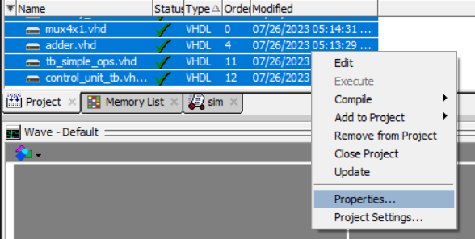
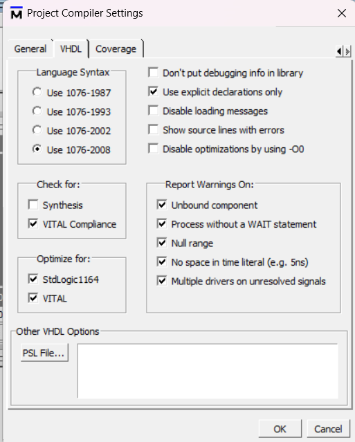
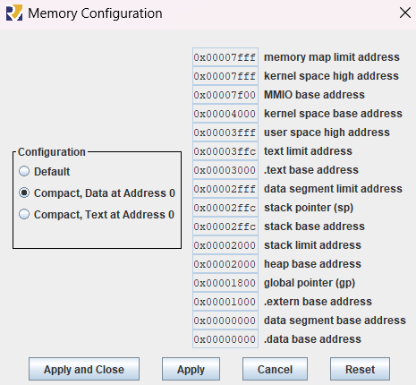
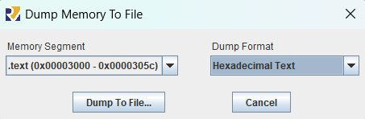

[Leia em portugues](./README.pt.md)

# RISCV Pipeline project

This project was developed for the Computer Architecture course in the Bachelor's degree program in Computer Engineering at the University of Brasília (UnB). It can be seen on [github](https://github.com/artistrea/RISCV_pipeline).

## Objective

Assembling 5-stage pipeline RISC-V processor using ModelSim. Generating hexadecimal files using Rars for testing purposes.

The processor should be capable of executing the following instructions:

ADDi, ORi, XORi, SLTi, SLTUi, ADD, SUB, AND, ANDi, SLT, OR, XOR, SLLi, SRLi, SRAi, SLTU, AUIPC, JAL, JALR, BEQ, BNE, BLT, BGE, BGEU, BLTU

As an additional feature, mechanisms can be implemented to handle hazards, but the _minimum requirement_ is a **processor simulator** that can **execute a program**, with the **program itself responsible** for **preventing hazards**.

## Organization

The project is organized as follows:

- `modelsim/`: contains ModelSim project files
- `public/`: includes images used in the README
- `rars/`: holds Rars files
- `helpers/`: contains auxiliary scripts for generating test files

## How to Run

Open the project, configure ModelSim correctly, and run the desired testbench.

### Configuring ModelSim

Add all files modelsim/\*.vhd to the modelsim project. Open the properties for all of them:


And use the `1076-2008` compilation option:



### Running the Testbench

Two main testbenches were created. Logical-arithmetic and memory operations are tested in `tb_simple_ops.vhd`, and branch operations are in `tb_complex_ops.vhd`. The first testbench should not be altered since tests for each operation were manually done.

The `tb_complex_ops.vhd` **testbench can be modified** to **test other programs**. To do this, change the line:

```vhdl
file text_file : text open read_mode is "../rars/complexOps/jalr/instr_dump.txt";
file data_file : text open read_mode is "../rars/complexOps/jalr/data_dump.txt";
file data_after_file : text open read_mode is "../rars/complexOps/jalr/data_after_dump.txt";
```

To:

```vhdl
file text_file : text open read_mode is "../rars/complexOps/<desired-test-name>/instr_dump.txt";
file data_file : text open read_mode is "../rars/complexOps/<desired-test-name>/data_dump.txt";
file data_after_file : text open read_mode is "../rars/complexOps/<desired-test-name>/data_after_dump.txt";
```

Check the `rars/complexOps/` folder for pre-created test options. After changing these lines to select the desired test, recompile and run the testbench.

Note that if there is any discrepancy between the expected and obtained results, the testbench will write an error message to the ModelSim console.

### Generating Test Files

This section is provided in case you want to create your own test files.

#### Configuring RARS

Configure the memory to have data memory starting at 0:


#### Assembly

Create a new folder in `rars/` to place files related to this test. Write the assembly code you want to test, and then dump the .text and .data memories in hexadecimal using Rars:


To run your test in the complexOps testbench, you need to dump 3 files:

- `instr_dump.txt` should contain the `.text` dump;
- `data_dump.txt` should contain the `.data` dump **before** running the program;
- `data_after_dump.txt` should contain `.data` dump **after** running the program (in Rars itself).

Next, use the `helpers/convert_hex.py` script to convert the Rars dump into a file that can be used by ModelSim without errors.

## Conclusion

At the end of the project, the following processor operations were implemented correctly:

ADDi, ORi, XORi, SLTi, SLTUi, ADD, SUB, AND, ANDi, SLT, OR, XOR, SLLi, SRLi, SRAi, SLTU, AUIPC, JAL, BEQ, BNE, BLT, BGE, BGEU, BLTU

The only instruction that presented issues when used was JALR.

No processor-level hazard solutions were implemented, so conflicts must be avoided by the software/compiler (assembly).

Harvard architecture was used in building the processor.
